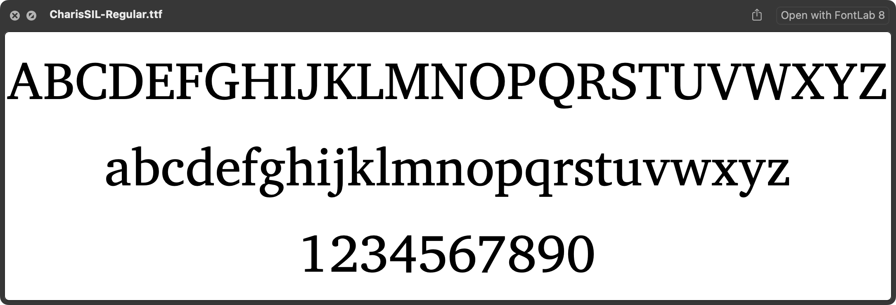
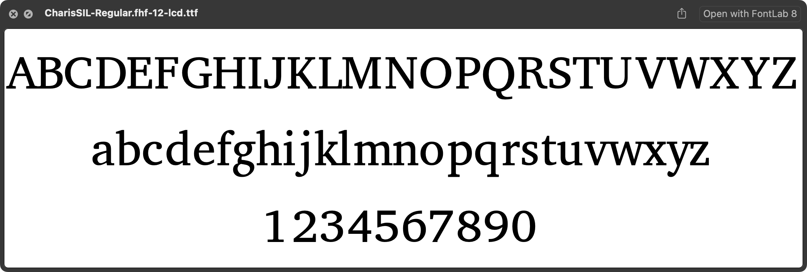
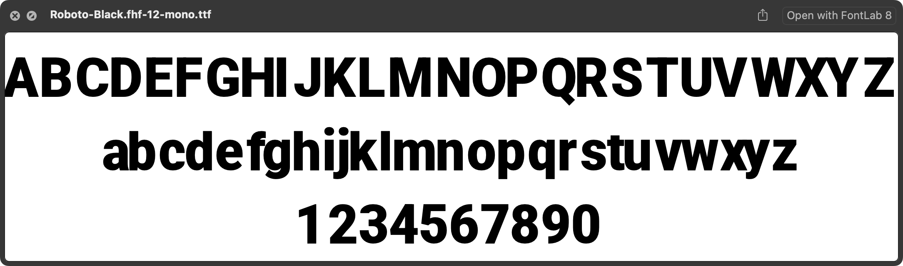

# OpenType Hinting Freezer (`pyfthintfreeze`)

`pyfthintfreeze` is a command-line tool and Python 3.x library that applies the TrueType hinting of an existing OpenType font to its contours at a specified Pixels-Per-EM (PPM) size. It then outputs a new font with these modified, "frozen" contours. This process effectively "bakes in" the hinting adjustments for a specific size directly into the font's outlines.

The tool leverages the FreeType library to execute the font's hinting instructions and extract the resulting pixel-fitted outlines. While it works best with TTF (TrueType flavored) fonts, basic support for OTF (CFF flavored) fonts is present but may be buggy.

## Who is this tool for?

This tool is designed for:

*   **Font Developers & Typographers:** Who need to ensure consistent and high-quality font rendering at specific, critical sizes.
*   **Graphics Engineers & Application Developers:** Who work in environments where dynamic font hinting might be inconsistent, disabled, or unavailable, and require predictable text display.
*   **Web Designers & Developers:** Who want to serve web fonts optimized for particular sizes, ensuring sharp and clear text across different browsers and platforms.
*   **Embedded Systems Developers:** Where font rendering capabilities might be limited, and pre-rendered or size-specific adjustments are necessary.

## Why is it useful?

*   **Predictable Rendering:** By "freezing" hints into outlines for a specific PPM, you achieve highly predictable glyph shapes at that size, minimizing variations across different rendering engines.
*   **Improved Readability:** For small text sizes, especially on lower-resolution displays, baked-in hinting can significantly improve clarity and legibility.
*   **Performance:** In some scenarios, using fonts with pre-applied hinting can be more performant as the rendering engine doesn't need to execute complex hinting instructions dynamically.
*   **Workaround for Limited Hinters:** Useful when targeting platforms with poor or no support for interpreting advanced TrueType hinting.

## Installation

You can install `opentype-hinting-freezer` from PyPI or directly from GitHub.

**From PyPI (recommended):**

```bash
pip install opentype-hinting-freezer
```

**From GitHub (latest version):**

```bash
pip install git+https://github.com/twardoch/fonttools-opentype-hinting-freezer.git
```

**Local installation (for development or direct use):**

1.  Clone the repository:
    ```bash
    git clone https://github.com/twardoch/fonttools-opentype-hinting-freezer.git
    cd fonttools-opentype-hinting-freezer
    ```
2.  Install (preferably in a virtual environment):
    ```bash
    # Using pip
    pip install .

    # Or with uv (see Development Setup for installing uv)
    uv pip install .
    ```

## Usage

`pyfthintfreeze` can be used as a command-line tool or as a Python library.

### Command-Line Interface (CLI)

The primary interface is the `pyfthintfreeze` command-line tool.

```
$ pyfthintfreeze --help
NAME
    pyfthintfreeze - OpenType font hinting freezer.

SYNOPSIS
    pyfthintfreeze FONTPATH <flags>

DESCRIPTION
    A tool that applies the hinting of an OT font
    to the contours at a specified PPM size,
    and outputs the font with modified contours.
    (Works better with TTF, OTF support is buggy)

    Example:
    pyfthintfreeze font.ttf --ppm=14 --mode="mono"

POSITIONAL ARGUMENTS
    FONTPATH
        Path to an OTF, TTF, or TTC file.

FLAGS
    --out=OUT
        Output path for the modified font. If absent, an automatic name is generated
        in the same directory as the input font (e.g., `font.fhf-12-mono.ttf`).
    --ppm=PPM
        The Pixels-Per-EM (PPM) size at which the hinting should be applied.
        If not provided, the font's units-per-EM will be used (effectively no scaling, which might not be what you want for visual "freezing").
    --subfont=SUBFONT
        The index of the subfont to process in a TTC (TrueType Collection) file.
        Default: 0.
    --var=VAR
        Variable font location as a dictionary string (e.g., '{"wght": 700, "wdth": 100}').
        This is applied if the font is a variable font and has an 'fvar' table.
        Example: --var='{"wght":750}'
    --mode=MODE
        Hinting mode for FreeType rendering. Options:
        - "lcd" (default): Subpixel anti-aliasing for LCD screens (horizontal RGB).
        - "lcdv": Vertical LCD subpixel anti-aliasing (vertical RGB).
        - "mono": Monochrome (black and white) rendering, aliased.
        - "light": Lighter anti-aliasing, suitable for high-DPI screens or when less aggressive hinting is desired.
```

**Example CLI Usage:**

To process `MyFont.ttf` at 16 PPM using LCD hinting mode and save it as `MyFont-frozen-16lcd.ttf`:

```bash
pyfthintfreeze MyFont.ttf --ppm=16 --mode="lcd" --out MyFont-frozen-16lcd.ttf
```

If `--out` is omitted, the output will be, for example, `MyFont.fhf-16-lcd.ttf` in the same directory as `MyFont.ttf`.

### Programmatic Usage (Python Library)

You can use `opentype-hinting-freezer` directly in your Python scripts.

**Import the main function:**

```python
from opentype_hinting_freezer import freezehinting
```

**Function Signature:**

```python
freezehinting(
    fontpath: Union[str, Path],
    out: Optional[Union[str, Path]] = None,
    ppm: Optional[int] = None,
    subfont: int = 0,
    var: Optional[Dict[str, float]] = None,
    mode: str = "lcd"
) -> None
```

**Parameters:**

*   `fontpath`: Path to the input OpenType font file (TTF, OTF, TTC).
*   `out` (optional): Path for the output (frozen) font. If `None`, an automatic name is generated (e.g., `font.fhf-PPM-MODE.suffix`).
*   `ppm` (optional): The Pixels-Per-EM size. If `None`, the font's units-per-EM will be used by `FontHintFreezer` (effectively applying hinting at UPM scale, which means outlines might not change visually unless UPM is very small). For visual freezing, a typical screen PPM (e.g., 10-48) is expected.
*   `subfont` (optional): Index of the subfont in a TrueType Collection (`.ttc`). Defaults to 0.
*   `var` (optional): A dictionary specifying the variable font instance location, e.g., `{'wght': 700, 'wdth': 100}`. Applied if the font is variable.
*   `mode` (optional): Hinting mode. One of `"lcd"` (default), `"lcdv"`, `"mono"`, `"light"`.

**Example Python Script:**

```python
from opentype_hinting_freezer import freezehinting
from pathlib import Path

input_font = Path("path/to/your/Font.ttf")
output_font = Path("path/to/your/Font-frozen.ttf")
target_ppm = 12
hinting_mode = "mono"  # or "lcd", "lcdv", "light"
variable_settings = {"wght": 500} # Optional, for variable fonts

try:
    freezehinting(
        fontpath=input_font,
        out=output_font,
        ppm=target_ppm,
        mode=hinting_mode,
        var=variable_settings # Pass None or omit if not a variable font or no specific instance needed
    )
    print(f"Successfully froze hints for {input_font.name} to {output_font.name}")
except Exception as e:
    print(f"An error occurred: {e}")

```

## Technical Details

### How the Code Works

The core logic of `pyfthintfreeze` revolves around using the FreeType library to render glyphs with their native hinting instructions at a specific PPM, then capturing these hinted outlines and saving them back into a new font using `fontTools`.

1.  **Initialization (`freezehinting` function in `hintingfreezer.py`):**
    *   The main `freezehinting()` function is the primary entry point for both CLI and library usage.
    *   It reads the font data from the given `fontpath`.
    *   It instantiates `FontHintFreezer`.

2.  **`FontHintFreezer` Class:**
    *   **`__init__(font_data, font_number, ppm, render_mode)`:**
        *   Loads the font into two objects:
            *   A `fontTools.ttLib.TTFont` object: Used for inspecting font tables, manipulating glyph data, and saving the modified font.
            *   A `freetype.Face` object: Used for accessing FreeType's hinting and rendering capabilities.
        *   Sets the character size on the `ftFace` using `ftFace.set_char_size(ppm * 64, ...)`. This tells FreeType the target PPM for hinting.
        *   Calculates a `rescale_glyphs` transformation matrix and applies it using `ftFace.set_transform()`. This is crucial for scaling the hinted outlines from FreeType's internal grid-fitted representation back to the font's original units-per-EM (UPM) space. The outlines are hinted at PPM, but stored in font units.
        *   Determines the FreeType load flag (e.g., `FT_LOAD_TARGET_LCD`, `FT_LOAD_TARGET_MONO`) based on the `render_mode`.
    *   **`set_var_location(var_location: Dict[str, float])`:**
        *   If the font has an `fvar` table (i.e., it's a variable font) and `var_location` is provided, this method sets the FreeType instance to the specified design coordinates using `FT_Set_Var_Design_Coordinates`. This ensures hinting is applied for that specific instance.
    *   **`freeze_hints()`:**
        *   This is the main method that processes glyphs.
        *   It iterates through all glyph names in the font.
        *   **For TrueType (`glyf`) Fonts:**
            *   Calls `draw_glyph_to_tt_glyph()` for each glyph.
            *   `prep_glyph()`:
                *   Loads the glyph into FreeType's glyph slot using `self.ftFace.load_glyph(glyph_id, FT_LOAD_RENDER | self.ft_flag)`. The `FT_LOAD_RENDER` flag ensures hinting is applied.
                *   Extracts hinted horizontal metrics (advance width, left side bearing) from `self.ftFace.glyph.metrics` and scales them back to font units.
            *   `draw_glyph_to_point_pen(pen)`:
                *   This method is responsible for extracting the hinted outline coordinates.
                *   It iterates over the contours, points, and tags from `self.ftFace.glyph.outline`. FreeType provides these coordinates already hinted and grid-fitted to the PPM scale.
                *   It translates these FreeType outline structures into segment commands (beginPath, addPoint, endPath) for a `fontTools` `PointPen`. The points are already scaled by the transformation matrix set earlier.
            *   A `TTGlyphPointPen` (a type of `PointPen`) is used to collect these outline points and construct a new `fontTools` `Glyph` object.
            *   The newly created `Glyph` object (containing the hinted outline) replaces the original glyph in the `ttFont['glyf']` table.
            *   The scaled hinted metrics are updated in the `ttFont['hmtx']` table.
        *   **For CFF (OTF) Fonts (Experimental/Buggy):**
            *   Calls `draw_glyph_to_ps_glyph()` for each glyph.
            *   The process is similar but uses a `T2CharStringPen` to attempt to reconstruct a Type 2 charstring from the hinted outlines. This is more complex and less robust than handling TrueType outlines. CFF hinting models are different, and "freezing" them this way might not always yield expected results.
    *   **Font Saving:** After all glyphs are processed, the modified `ttFont` object (with hinted outlines and metrics) is saved to the specified output file path.

### Key Libraries and Tools

*   **`fontTools`**: The cornerstone for OpenType and TrueType font manipulation in Python. Used for reading, parsing, modifying, and saving font files.
*   **`freetype-py`**: Python bindings for the FreeType library. FreeType is the engine that performs the actual font rendering and hinting.
*   **`python-fire`**: Used to quickly generate the command-line interface from the `freezehinting` function.
*   **`Hatch`**: The build backend specified in `pyproject.toml`, used for managing project builds, versions, and running tasks (like linting, testing).
*   **`uv`**: A fast Python package installer and virtual environment manager, recommended for development.
*   **`Ruff`**: Used for code formatting and linting, ensuring code quality and consistency.
*   **`Mypy`**: A static type checker for Python, helping to catch type errors.
*   **`Pytest`**: The framework used for running automated tests.

### Codebase Structure

*   `opentype_hinting_freezer/`: The main Python package.
    *   `__init__.py`: Makes the directory a package and exports the main `freezehinting` function and `__version__`.
    *   `__main__.py`: Provides the command-line interface (CLI) entry point using `python-fire`. It calls `freezehinting`.
    *   `hintingfreezer.py`: Contains the core logic:
        *   `FontHintFreezer` class: Manages the font loading, FreeType interaction, outline extraction, and modification of `fontTools` objects.
        *   `freezehinting()`: The main public function that orchestrates the process.
*   `tests/`: Contains all automated tests.
    *   `data/`: Test assets, such as `minimal.ttf`.
    *   `generate_minimal_ttf.py`: Script to generate the `minimal.ttf` used in tests.
    *   `test_hintingfreezer_unit.py`: Unit tests for components within `hintingfreezer.py`.
    *   `test_cli_integration.py`: Integration tests for the `pyfthintfreeze` CLI.
*   `assets/`: Contains images used in this README.
*   `pyproject.toml`: Defines project metadata, dependencies, build system (Hatch), and configurations for tools like Ruff and Mypy (via `mypy.ini`).
*   `setup.py`: Legacy setup file, primarily used by `setuptools` for tasks like `get_version()`. Modern packaging relies more on `pyproject.toml`.
*   `mypy.ini`: Configuration for the Mypy static type checker.
*   `.pre-commit-config.yaml`: Configuration for pre-commit hooks, ensuring code quality before commits.
*   `.github/workflows/`: Contains GitHub Actions workflows for continuous integration (CI).

## Contributing

Contributions are highly welcome! Please adhere to the following guidelines to ensure a smooth development process.

### Development Environment Setup

We recommend using `uv` for fast virtual environment and package management, and `hatch` for running development tasks (linting, testing, building), which are configured in `pyproject.toml`.

1.  **Install `uv`**:
    Follow the official instructions to install `uv`: [https://github.com/astral-sh/uv#installation](https://github.com/astral-sh/uv#installation)

2.  **Clone the repository (if you haven't already):**
    ```bash
    git clone https://github.com/twardoch/fonttools-opentype-hinting-freezer.git
    cd fonttools-opentype-hinting-freezer
    ```

3.  **Create and activate a virtual environment using `uv`:**
    ```bash
    uv venv .venv
    source .venv/bin/activate  # On Windows: .venv\Scripts\activate
    ```

4.  **Install dependencies:**
    Install the project in editable mode along with development dependencies:
    ```bash
    uv pip install -e .[dev]
    ```
    This command installs `opentype-hinting-freezer` itself in editable mode, plus all tools needed for development like Ruff, Mypy, and Pytest.

### Running Quality Checks and Tests

Common development tasks are defined as scripts in `pyproject.toml` and can be run with `hatch`.

*   **Formatting**: `hatch run format` (uses Ruff to format code)
*   **Linting**: `hatch run lint` (uses Ruff to check for style issues and potential errors)
*   **Type Checking**: `hatch run typecheck` (uses Mypy to check for type consistency)
*   **Testing**: `hatch run test` (uses Pytest to run all unit and integration tests)
*   **Test Coverage**: `hatch run test-cov` (runs tests and generates a coverage report)
*   **All Checks**: `hatch run check` (runs format, lint, typecheck - a good command to run before committing)
*   **Building**: `hatch run build` (builds source distribution (sdist) and wheel)

### Pre-commit Hooks

This project uses `pre-commit` to automatically run linters and formatters on your code before you commit it. This helps maintain code quality and consistency.

After installing development dependencies (which includes `pre-commit`), install the git hooks:

```bash
pre-commit install
```

Now, the configured hooks (e.g., Ruff for formatting and linting, Mypy for type checking) will run automatically on every `git commit`. If a hook modifies a file, you'll need to `git add` the changes and re-commit.

### Coding Standards

*   Follow **PEP 8** for Python code style. Ruff helps enforce this.
*   Write **clear, commented code** where the logic is not immediately obvious.
*   Ensure code is **well-typed** and passes Mypy checks.
*   **Write tests** for new features or bug fixes. Ensure all tests pass (`hatch run test`).
*   Keep commit messages **clear and descriptive**. Consider using [Conventional Commits](https://www.conventionalcommits.org/) for commit message formatting, although not strictly enforced.

### Submitting Changes

1.  Create a new branch for your feature or bug fix: `git checkout -b my-feature-branch`.
2.  Make your changes, run `hatch run check` and `hatch run test` to ensure everything is okay.
3.  Commit your changes. Pre-commit hooks will run automatically.
4.  Push your branch to GitHub: `git push origin my-feature-branch`.
5.  Open a Pull Request (PR) against the `main` branch of the repository.
6.  Clearly describe your changes in the PR and link to any relevant issues.

## Examples from the Original README

The following examples illustrate the effect of `pyfthintfreeze`.

```
pyfthintfreeze CharisSIL-Regular.ttf --ppm=12 --mode="lcd"
```

Original [CharisSIL-Regular.ttf](https://github.com/google/fonts/blob/main/ofl/charissil/CharisSIL-Regular.ttf) font:



The font with hinting in LCD mode applied at 12 PPM:



---

```
pyfthintfreeze Roboto-Black.ttf --ppm=12 --mode="mono"
```

Original [Roboto-Black.ttf](https://github.com/google/fonts/blob/main/apache/roboto/static/Roboto-Black.ttf) font:


The font with hinting in monochrome mode applied at 12 PPM:




## Credits and License

*   Copyright (c) 2022 by [Adam Twardoch and others](./AUTHORS.txt)
*   Code by [Adam Twardoch and others](./CONTRIBUTORS.txt)
*   Licensed under the [Apache-2.0 License](./LICENSE)
