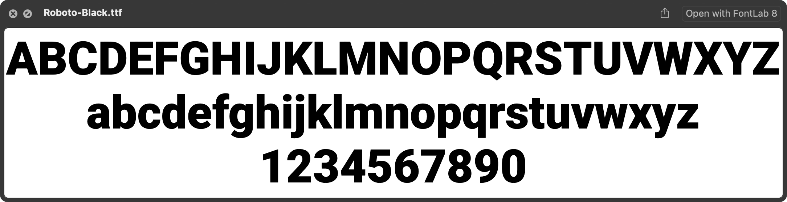

# OpenType Hinting Freezer (`pyfthintfreeze`)

`pyfthintfreeze` is a command-line tool and Python 3.x library that applies the TrueType hinting of an existing OpenType font to its contours at a specified Pixels-Per-EM (PPM) size. It then outputs a new font with these modified, "frozen" contours. This process effectively "bakes in" the hinting adjustments for a specific size directly into the outlines.

The tool uses FreeType to execute the font's hinting instructions. While it works best with TTF (TrueType flavored) fonts, basic support for OTF (CFF flavored) fonts is present but may be buggy.

This project has been modernized to use current Python packaging and development best practices, including `pyproject.toml` with Hatch for building, `uv` for environment management, Ruff for linting/formatting, Mypy for type checking, Pytest for testing, and pre-commit hooks for quality assurance.

## Installation

This tool will be available on PyPI. Once published, you can install it using pip:

```bash
pip install opentype-hinting-freezer
```

Alternatively, to install the latest version directly from GitHub:

```bash
pip install git+https://github.com/twardoch/fonttools-opentype-hinting-freezer.git
```

Or, after cloning the repository, you can install it locally (preferably in a virtual environment):
```bash
# Using pip
pip install .

# Or with uv (see Development Setup for installing uv)
uv pip install .
```

## Usage

The primary interface is the `pyfthintfreeze` command-line tool.

```
NAME
    pyfthintfreeze - OpenType font hinting freezer.

SYNOPSIS
    pyfthintfreeze FONTPATH <flags>

DESCRIPTION
    A tool that applies the hinting of an OT font
    to the contours at a specified PPM size,
    and outputs the font with modified contours.
    (Works better with TTF, OTF support is buggy)

    Example:
    pyfthintfreeze font.ttf --ppm=14 --mode="mono"

POSITIONAL ARGUMENTS
    FONTPATH
        Path to an OTF, TTF, or TTC file.

FLAGS
    --out=OUT
        Output path for the modified font. If absent, an automatic name is generated
        in the same directory as the input font (e.g., `font.fhf-12-mono.ttf`).
    --ppm=PPM
        The Pixels-Per-EM (PPM) size at which the hinting should be applied.
        If not provided, the font's units-per-EM will be used (effectively no scaling).
    --subfont=SUBFONT
        The index of the subfont to process in a TTC (TrueType Collection) file.
        Default: 0.
    --var=VAR
        Variable font location as a dictionary string (e.g., '{"wght": 700, "wdth": 100}').
        This is applied if the font is a variable font and has an 'fvar' table.
        Example: --var='{"wght":750}'
    --mode=MODE
        Hinting mode. Options:
        - "lcd" (default): Subpixel anti-aliasing for LCD screens.
        - "lcdv": Vertical LCD subpixel anti-aliasing.
        - "mono": Monochrome (black and white) rendering.
        - "light": Lighter anti-aliasing, suitable for high-DPI screens.

NOTES
    You can also use flags syntax for POSITIONAL ARGUMENTS (e.g., --fontpath=path/to/font.ttf).
```

## Contributing

Contributions are welcome! Please follow these guidelines.

### Development Environment Setup

We recommend using `uv` for fast environment and package management, and `hatch` for task running (linting, testing, building), which is configured in `pyproject.toml`.

1.  **Install `uv`**:
    Follow the official instructions to install `uv`: [https://github.com/astral-sh/uv#installation](https://github.com/astral-sh/uv#installation)

2.  **Create and activate a virtual environment**:
    ```bash
    uv venv .venv
    source .venv/bin/activate  # On Windows: .venv\Scripts\activate
    ```

3.  **Install dependencies**:
    Install the project in editable mode along with development dependencies:
    ```bash
    uv pip install -e .[dev]
    ```
    This installs `opentype-hinting-freezer` and tools like Ruff, Mypy, Pytest.

### Running Quality Checks and Tests

Common development tasks are defined as scripts in `pyproject.toml` and can be run with `hatch`.

*   **Formatting**: `hatch run format` (uses Ruff to format code)
*   **Linting**: `hatch run lint` (uses Ruff to check for style issues)
*   **Type Checking**: `hatch run typecheck` (uses Mypy)
*   **Testing**: `hatch run test` (uses Pytest to run unit and integration tests)
*   **Test Coverage**: `hatch run test-cov` (runs tests and shows coverage report)
*   **All Checks**: `hatch run check` (runs format, lint, typecheck - tests can be added here too)
*   **Building**: `hatch run build` (builds sdist and wheel)

### Pre-commit Hooks

This project uses `pre-commit` to ensure code quality before committing. After installing development dependencies (which includes `pre-commit`), install the git hooks:

```bash
pre-commit install
```
The configured hooks (Ruff, Mypy) will now run automatically on every commit.

### Codebase Structure

The project is organized as follows:

*   `opentype_hinting_freezer/`: The main package directory.
    *   `__init__.py`: Makes the directory a package and exports the main `freezehinting` function and `__version__`.
    *   `__main__.py`: Provides the command-line interface (CLI) entry point using `python-fire`. It imports `freezehinting` and exposes it to the CLI.
    *   `hintingfreezer.py`: Contains the core logic.
        *   `FontHintFreezer` class: Handles the actual process of loading a font with FreeType, applying hinting at a specific PPM, and extracting the modified glyph outlines.
        *   `read_from_path()`: A utility function to read font data from a file path.
        *   `freezehinting()`: The main public function that orchestrates the process using `FontHintFreezer`. It's the primary function imported by `__main__.py` for the CLI and can also be used as a library function.
*   `tests/`: Contains all tests.
    *   `data/`: Test assets, like the `minimal.ttf` font.
    *   `generate_minimal_ttf.py`: Script to generate `minimal.ttf`.
    *   `test_hintingfreezer_unit.py`: Unit tests for components within `hintingfreezer.py`.
    *   `test_cli_integration.py`: Integration tests for the `pyfthintfreeze` CLI.
*   `pyproject.toml`: Defines project metadata, dependencies, build system (Hatch), and tool configurations (Ruff, Mypy via `mypy.ini` which is referenced).
*   `mypy.ini`: Configuration for Mypy static type checker.
*   `.pre-commit-config.yaml`: Configuration for pre-commit hooks.
*   `.github/workflows/ci.yml`: GitHub Actions workflow for continuous integration (linting, testing, building across Python versions).

### Data Flow (Simplified)

1.  **CLI (`__main__.py`) / Library Call (`freezehinting`)**: User provides font path, PPM, mode, etc.
2.  `freezehinting()` in `hintingfreezer.py` is called.
3.  `read_from_path()` reads font data.
4.  A `FontHintFreezer` instance is created with the font data and parameters.
    *   `__init__`: Loads the font with `fontTools.ttLib.TTFont` and `freetype.Face`. Sets up scaling factors based on PPM and UPM. Configures FreeType for the specified rendering mode and PPM.
    *   If variable font parameters (`var`) are provided, `set_var_location()` is called to set the FreeType instance to that design location.
5.  `freeze_hints()` method is called on the `FontHintFreezer` instance.
    *   It iterates through glyphs in the font.
    *   For each glyph:
        *   `prep_glyph()`: Loads the glyph with FreeType at the chosen PPM and render mode, which applies hinting. Extracts metrics (width, LSB).
        *   `draw_glyph_to_point_pen()` (or `draw_glyph_to_ps_glyph` for CFF): Extracts the hinted outline points from FreeType.
        *   The points are drawn into a new `fontTools` glyph object.
        *   The new glyph object replaces the old one in the `ttFont`'s `glyf` table (or `CFF ` table for OTF).
        *   Hinted metrics replace old metrics in the `hmtx` table.
6.  The modified `ttFont` object is saved to the output file path.

## Examples

```
pyfthintfreeze CharisSIL-Regular.ttf --ppm=12 --mode="lcd"
```

Original [CharisSIL-Regular.ttf](https://github.com/google/fonts/blob/main/ofl/charissil/CharisSIL-Regular.ttf) font:


The font with hinting in LCD mode applied at 12 ppm:


---

```
pyfthintfreeze Roboto-Black.ttf --ppm=12 --mode="mono"
```

Original [Roboto-Black.ttf](https://github.com/google/fonts/blob/main/apache/roboto/static/Roboto-Black.ttf) font: 



The font with hinting in monochrome mode applied at 12 ppm: 


## Credits and License

- Copyright (c) 2022 by [Adam Twardoch and others](./AUTHORS.txt)
- Code by [Adam Twardoch and others](./CONTRIBUTORS.txt)
- Licensed under the [Apache-2.0 License](./LICENSE)
